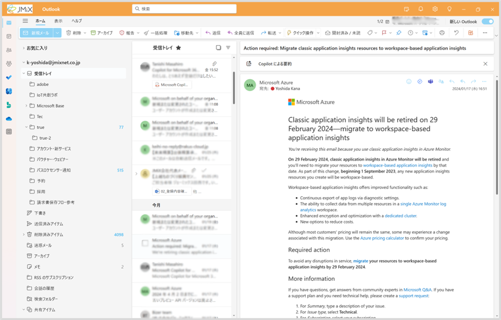
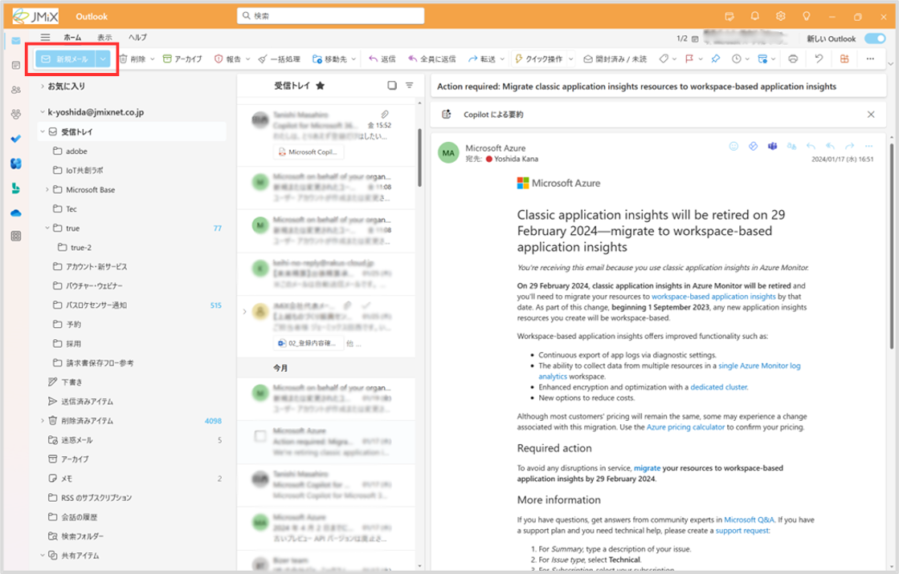
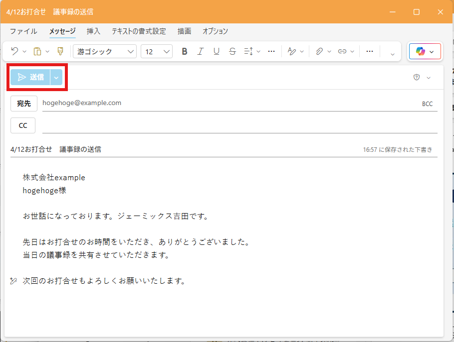
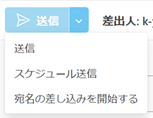
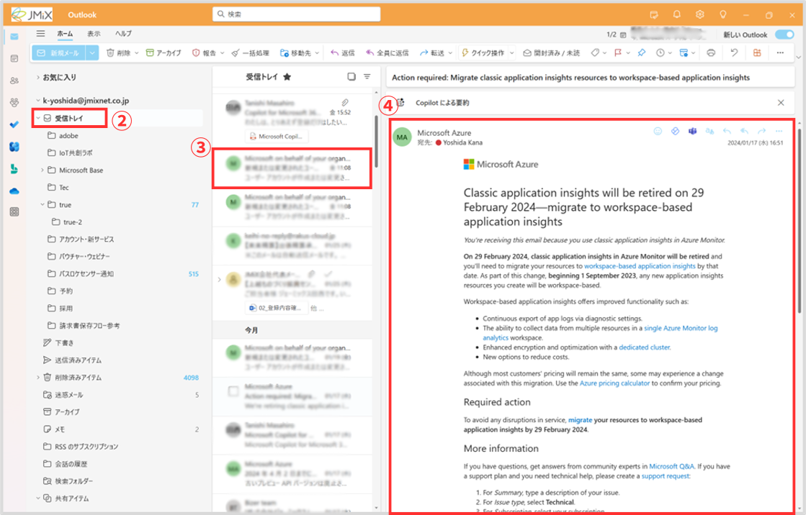
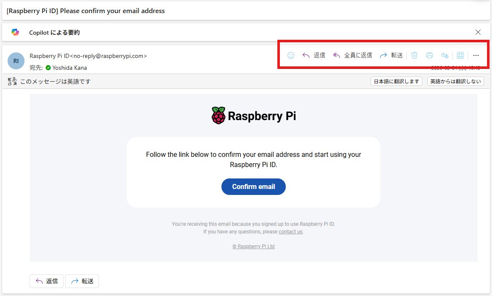

# メール

メールの送受信・管理を行います。

外部との仕事のやりとりの他、社内システムのメール通知としても利用しています。

---

## 使い方
### メールの作成
1. 「新規メール」をクリック

2. 宛先と件名、本文を入力
3. 「送信」をクリック

> [!NOTE]
> 送信ボタン右の矢印から、指定した時刻に送信する設定もできます  
> 

4. メールが送信されます

### メールの閲覧

1. 新規メールは**受信トレイ**に入ります
2. 閲覧したいフォルダをクリック
3. フォルダ内のメールが一覧表示されるので、閲覧したいメールをクリック
4. メールの内容を確認できます

### 受信したメールの操作
選択したメールの右上にあるアイコンから、メールの操作ができます。

* **返信**：**差出人のみ**に返信をします。差出人を宛先として、新規メール作成画面が立ち上がります
* **全員に返信**：差出人だけでなく、**ccも含めた全員**に返信をします。差出人を宛先、ccはそのままccに入れた状態で、新規メール作成画面が立ち上がります
* **転送**：ほかの人にメールを転送します。選択したメールの内容が本文にコピーされた状態で、新規メール作成画面が立ち上がります
* **削除**：ゴミ箱のマークをクリックすると、メールが削除されます。削除したメールは「削除済みアイテム」トレイから復元することができます。

#### その他の操作
メールをドラッグすると、サブフォルダへ移動できます

> [!IMPORTANT]  
> 受信トレイは常に未読のメールだけを入れておく状態（**ゼロトレイ**）を目指しましょう。  
> 保存しておくメールはサブフォルダに保管し、不要なメールはこまめに削除するのがおすすめです。  
> 重要なメールの見逃しや、ストレージの圧迫を防ぐことができます。

---
## これができたらOK
✔️ メールを閲覧する

✔️ サブフォルダを作成する

✔️ メールをサブフォルダに移動する

✔️ メールを送信する

---
[概要](./README.md) ⬅️ | [🏠](./README.md) | ➡️ [予定表](./01-calender.md)
