# 予定表
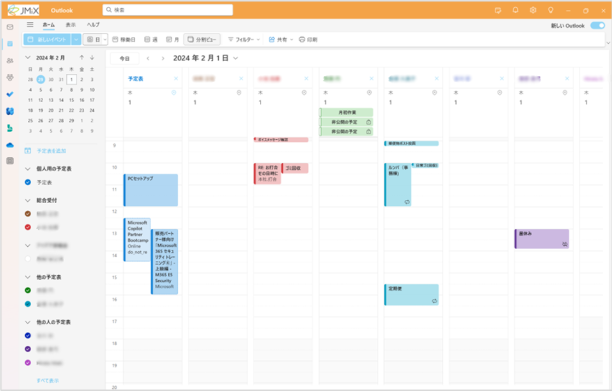

予定表の作成・管理を行います。

他の人の予定の閲覧や、会議室の予約もここで行います。

---
## 使い方
### 予定の作成
1. 「新しいイベント」をクリック

2. 予定のタイトルを入力
3. 出席者を入力
> [!NOTE]  
> 個人の予定（自分専用の予定）の場合は、入力不要です。

> [!NOTE]  
> 予定送信後、ほかの出席者に通知されます。  
> 組織のメンバーであればTeams/Outlookメールで通知されます。  
> 組織外の人はメールアドレスを入力することで、その宛先に招待メールを送信することができます。

4. 開始・終了時刻を入力

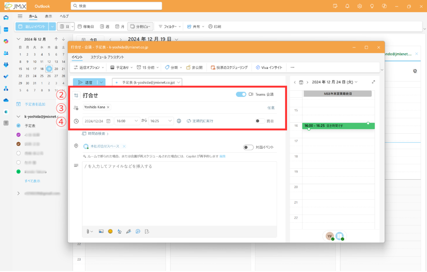

5. **【対面で開催する場合】** 会議室を入力
> [!NOTE]  
> 会議室を設定することで、予約ができます。  
> すでに予約されている会議室は、予約できません。  
> 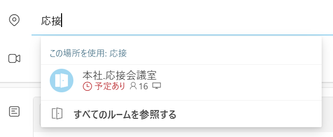

6. 「保存（送信）」をクリックして、予定を確定

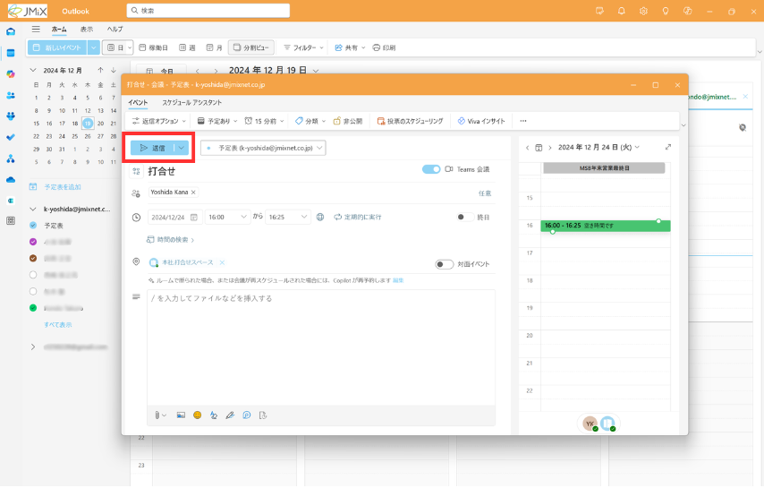

### 予定のキャンセル
自分が送信した予定が中止になった場合、ほかの参加者にキャンセル通知を送信することができます。

予定を開き、「**キャンセル**」をクリックすると、出席者にもキャンセル通知が送信されます。

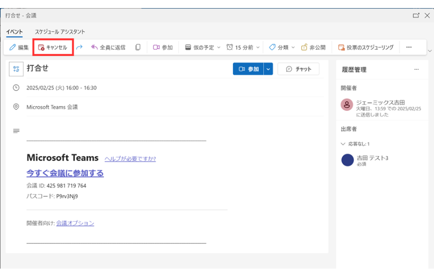

### 出席依頼の返信
他の人から、予定の出席依頼を受信することもあります。

出席する場合は「**はい**」、

しない場合は「**いいえ**」をクリックすると、相手に出席を返信できます。

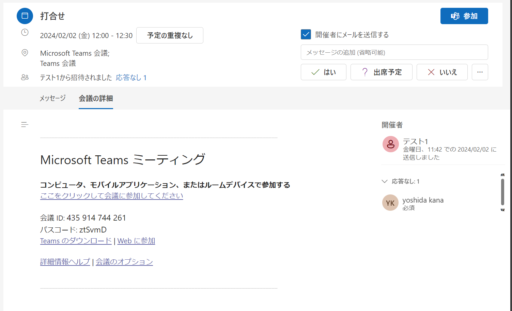

「はい（出席）」で返信すると、予定表に自動で登録されます。

（「いいえ」では登録されません）

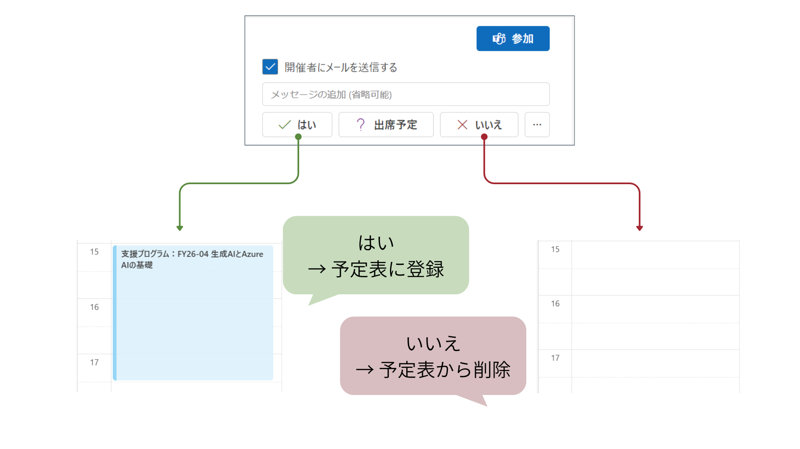

出席の返信前や、「**?出席予定**」で返信した場合は、仮の予定として表示されます。

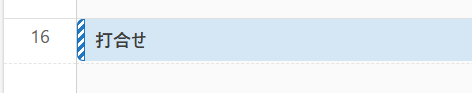

## 予定表の追加
組織のメンバーや、会議室の予定を追加しておくことで、閲覧ができます。

1. 「予定表の追加」をクリック

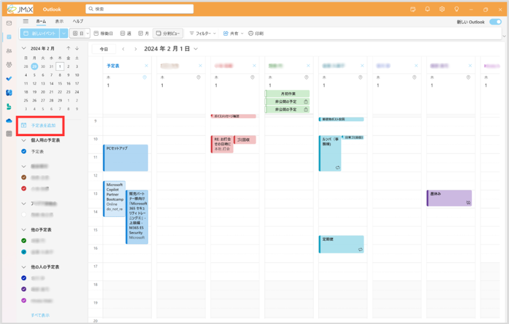

2. 「ディレクトリから追加」をクリック

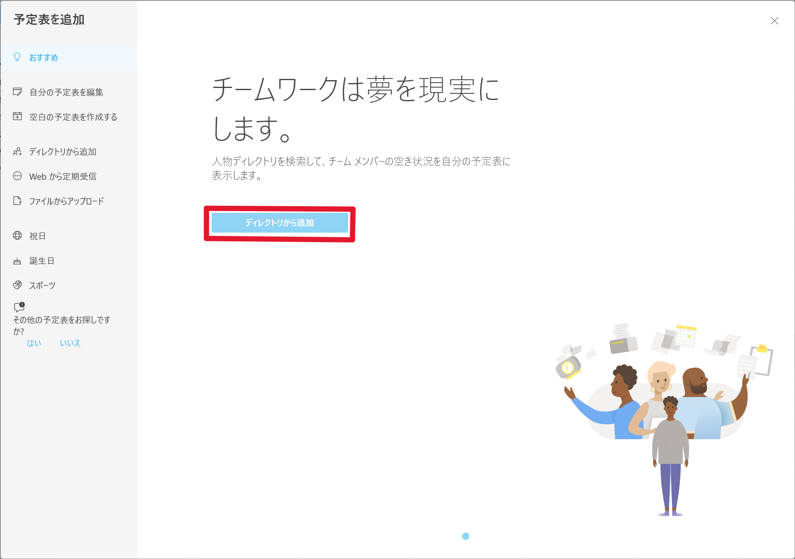

3. 追加したい人を検索して入力

4. 追加先のリストを選択
> [!NOTE]  
> はじめのうちは、既定で作成されている「他の人の予定表（各自のメールアドレス）」に追加してOKです。  
> 慣れてきたら、会議室や同じチームのメンバーなど、よく使うものでカテゴリ分けしておくと便利です。

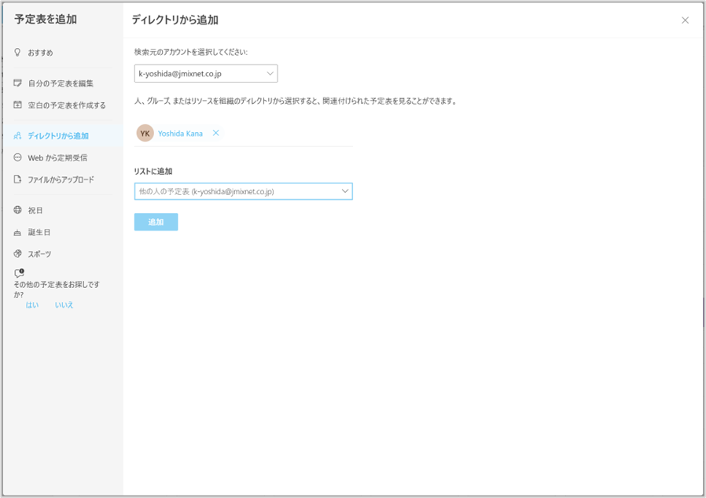

5. 「追加」をクリック

---
## これができたらOK
✔️ 予定を作成する

✔️ 他の人からの出席依頼に返信する

---
[メール](./00-mail.md) ⬅️ | [🏠](./README.md) | ➡️ [To Do](./02-todo.md)
