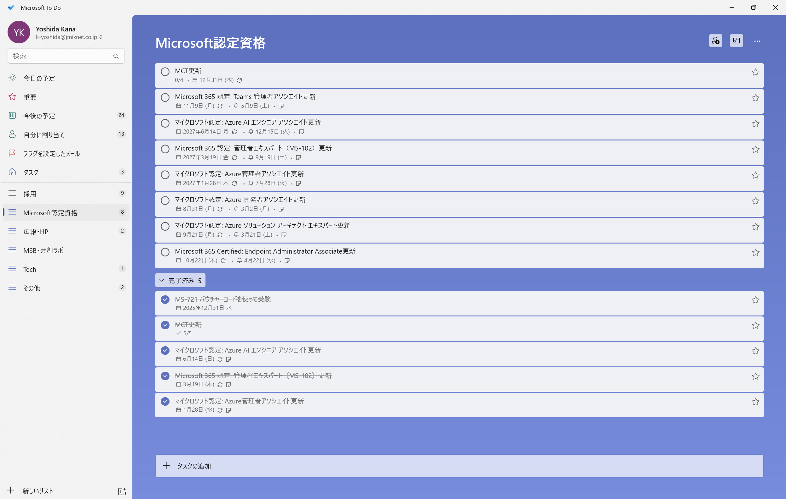
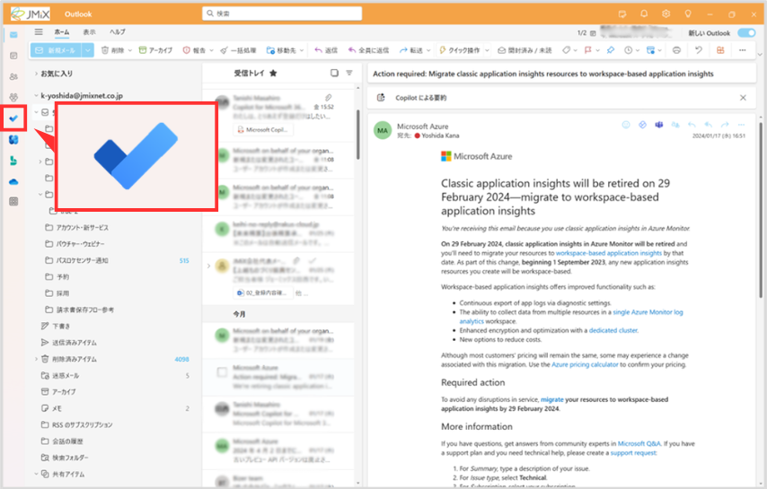
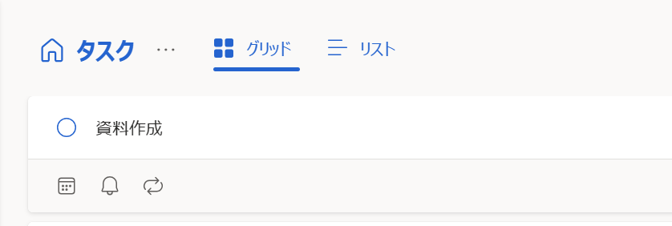
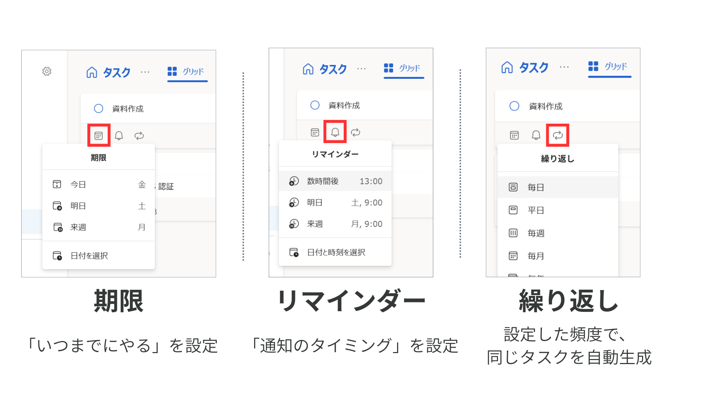
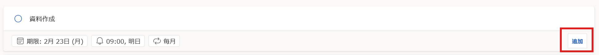
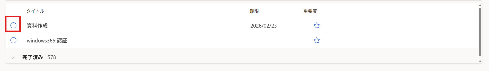
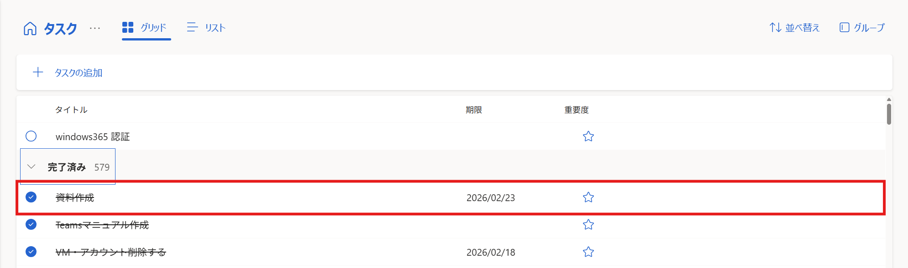

# Microsoft To Do

個人のタスク管理ツールです。

やることのリスト化や、アラーム・期限などを設定することができます。

---

## To Doの開始方法
複数のアクセス方法があります。

### Outlookからの利用

Outlookの「To Do」タブから、To Doにアクセスできます。

### デスクトップアプリからの利用
Outlookとは別に、To Do専用のデスクトップアプリがあります。
To Doのみ集中して管理したい場合や、複数アカウントのTo Doを操作したいときなどにおすすめです。

デスクトップアプリは、Microsoft Storeからインストールできます。

**【インストールページ】**

[Microsoft To Doアプリ - Microsoft Apps](https://apps.microsoft.com/detail/9nblggh5r558?hl=ja-JP&gl=JP)

[Microsoft To Doアプリ - App Store](https://apps.apple.com/jp/app/microsoft-to-do/id1212616790)

### スマホアプリからの利用
スマホアプリでも利用できます。

外出先でのリマインダーなどに便利です。

**【インストールページ】**

[Microsoft To Doアプリ - App Store](https://apps.apple.com/jp/app/microsoft-to-do/id1212616790)

[Microsoft To Doアプリ - Google Play](https://play.google.com/store/apps/details?id=com.microsoft.todos)

---

## 使い方
Outlook版での操作を紹介しますが、ほかの媒体でも同様に操作できます。

### タスクの追加
1. 新しいタスクを入力

2. **【任意】** 期限、アラーム、繰り返しなどを設定

3. 「追加」をクリック

### タスクを完了する
〇をクリックすると完了となり、タスク一覧から削除されます。

「完了済み」を展開すると、完了したタスクを確認できます。

ここで再度〇をクリックすると、タスクを未完了に戻すことができます。

---
## これができたらOK
✔️ タスクを作成する

✔️ タスクを完了する

---
[予定表](./01-calender.md) ⬅️ | [🏠](./README.md) 