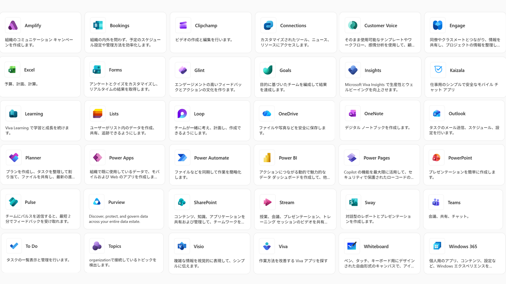
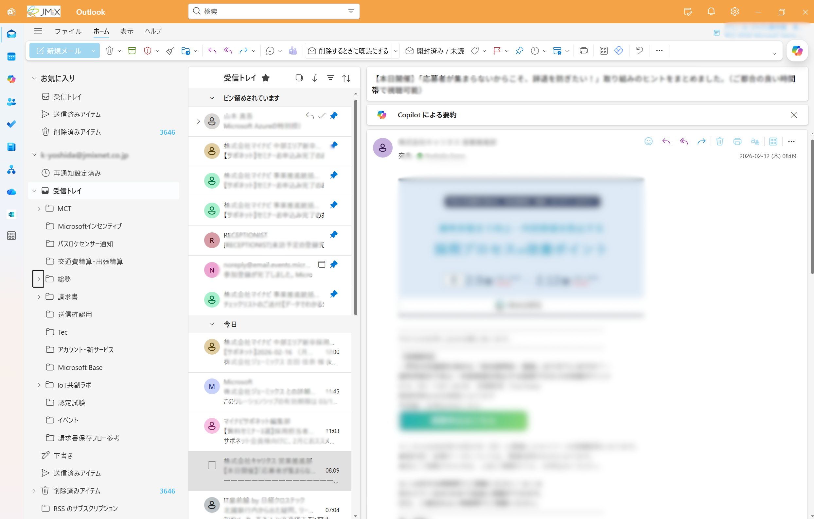

# Template-Getting-started-with-Outlook
Microsoft Outlookを始めるための、チュートリアルです。Microsoft Outlookの基本的な使い方を学びます。

# 目次
* [概要](./README.md)
* [メール](./00-mail.md)
* [予定表](./01-calender.md)
* [To Do](./02-todo.md)
* [TIPS：宛先・CC・BCCの使い分け](./TIPS.md) ← メールの途中で読むのがおすすめ

# Microsoft 365とは

Microsoft 365（マイクロソフト サンロクゴ）は、Office 365をはじめとしたMicrosoftの様々なアプリを、サブスクリプション契約で利用できるサービスです。

Word, Excel, PowerPointなどのアプリを、クラウド（インターネット）に接続して利用することで、常に最新のバージョンでアプリを利用できたり、社内の人と簡単にファイル共有を行うことができます。

# Microsoft Outlook

Microsoft Outlook（マイクロソフト アウトルック）は、メール・予定表を管理するコミュニケーション ツールです。

メールの送受信やカレンダー機能のほか、タスク管理ツールなどの関連機能も併設されています。

# Outlookのチュートリアル
次のページから、実際のOutlookの使い方を学びます。

---
 [🏠](./README.md) | ➡️ [メール](./00-mail.md)
